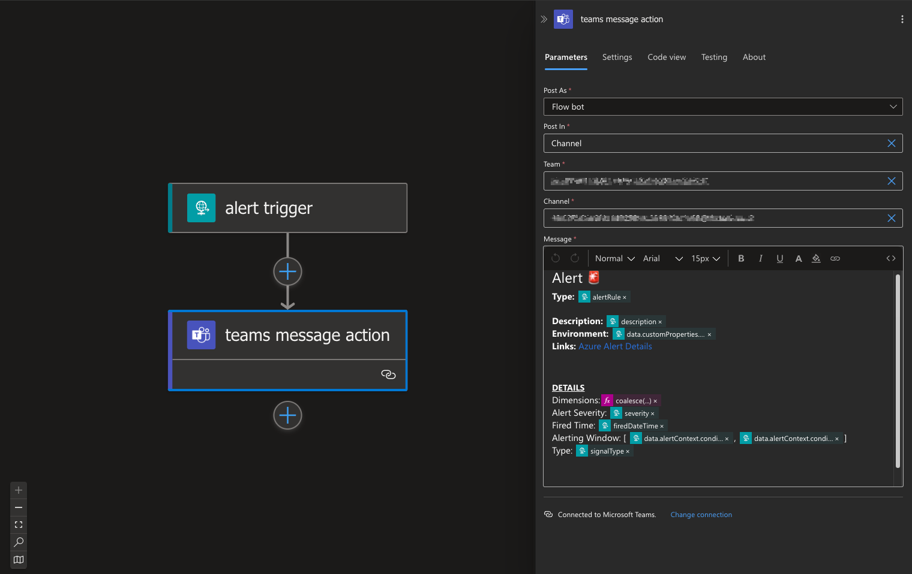
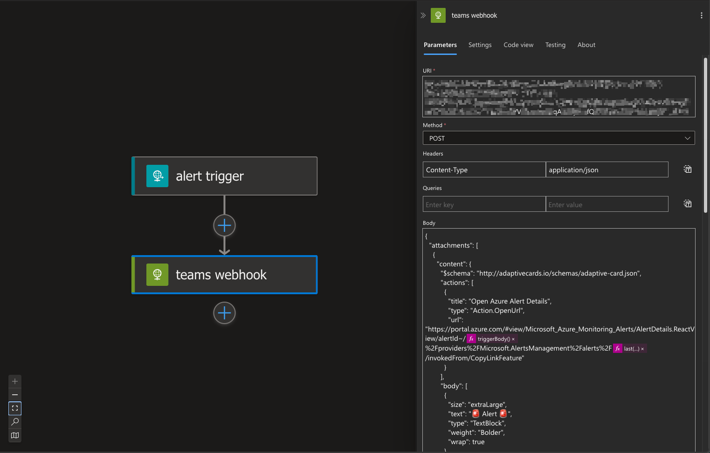

# Deploy Automated Teams Alerting

<!-- Tags: #IAC, #Teams,# Azure, #Tutorial -->

> **TL;DR:** Two ways to configure your solution to send alerts to a Teams channel and their pros and cons.

How many of you work on projects where you have alerts set up, but since they’re tucked away in your Azure portal, they mostly just collect dust 🕸️ — sometimes even auto-resolving without a developer ever looking at them?

Sound familiar? 🤔

A great solution is to reroute these alerts to something like Teams. After all, we spend most of our time in tools like Teams, so why not use it to our advantage and display alerts from our different environments there? 💡

Now, you might think, “Well, if they auto-resolve, why should I care?” 🤷‍♂️

I’d argue you should care. More often than not, transient errors are actually recurring issues. Ignoring them won’t make them go away! By getting properly notified whenever one occurs, you can keep them from slipping into the pile of 'resolved-but-ignored' alerts 🚨

So lets have a look at the the options you can set this up via IaC!

## Option 1: Teams Connector on Azure Logic Apps

Use the logic Apps Teams Action to post messages into a teams channel

> 📦 Sample on how this can be deployed using Terraform can be found here [`logic_app_connector`](./logic_app_connector/)

### Known Issues

#### Manual Authorization step

In this approach, a person must manually authorize the connector before it can be used in the Logic App. 🔐 Since the connector relies on the Microsoft Graph API and Office 365 API 📊 to programmatically send Teams messages 💬, the authorization process uses the OAuth 2.0 Authorization Code Grant flow 🔑. This flow requires the user to sign in, and as of now, it cannot be automated ⏳.

#### Authorization to different User via Portal

The authorization step in the Azure portal always uses the logged-in user for authentication, regardless of which user is selected in the login wizard. 🔑 For more details, check out [this response to a post on StackOverflow 💬](https://stackoverflow.com/questions/53530638/how-do-you-authenticate-a-logic-app-microsoft-web-connections-connection-with-co).

<!-- #### Token timeout

> TBD: Is there a potential time out?
> Notes: [Re-auth Azure Monitor Logs API connection](https://learn.microsoft.com/en-us/answers/questions/241612/azure-monitor-logs-api-connection) -->

## Option 2: Teams Webhook

The Teams Webhook feature allows you to send an action card by making a POST request to an exposed endpoint 📨. This enables you to integrate external systems with Teams and deliver interactive notifications or messages directly into a channel 🚀. In this case you are not required to have a user manually authenticate, however you need the to be the MS Teams team admit to be able to create such a webhook endpoint.

> 📦 Sample on how this can be deployed using Terraform can be found here [`logic_app_webhook`](./logic_app_webhook/)

## Resources

- [MS Teams Power Platform docs](https://learn.microsoft.com/en-us/connectors/teams/?tabs=text1%2Cdotnet)
- [Teams Webhook Docs](https://learn.microsoft.com/en-us/connectors/teams/?tabs=text1%2Cdotnet#microsoft-teams-webhook)
- [Graph API](https://learn.microsoft.com/en-us/graph/overview)
- [Graph API authentication](https://learn.microsoft.com/en-us/graph/auth/auth-concepts)
